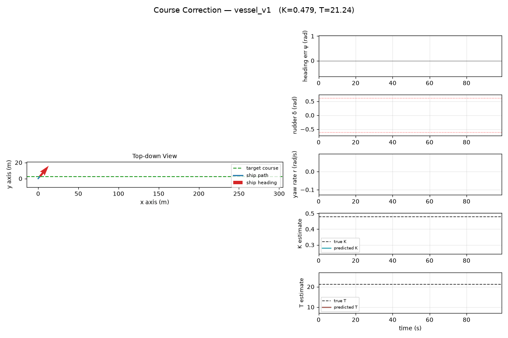

# Autonomous Surface Vessel Course-Keeping

A research project for ship course-keeping. It aims to hold a target heading under random wave noise and unknown, varying ship dynamics.



It uses the 2 approahces to compare on the same task:

1. **Reinforcement Learning (PPO):** It is a `RecurrentPPO` agent with an LSTM policy. It learns to adapt to the ship's dynamics from the history of its observations, without being told the ship's parameters.
2. **System Identification + MPC:** It is a two stage controller. A GRU network (`SysIDNet`) estimates the ship's parameters online, and a Model Predictive Controller (solved with `OSQP`) computes the rudder command.

---

## How It Works

### 1. Nomoto Environment (Gymnasium)

The ship follows the discrete time **first order Nomoto model**:

$$ T \dot{r} + r = K \delta $$

where $r$ is the yaw rate, $\delta$ is the rudder angle, $K$ is the steering gain, and $T$ is the turning inertia (time constant).

- **Domain randomization**: `K` and `T` are re-sampled from uniform ranges at every episode reset, so the controller faces a different ship each episode and never sees the true values.
- **Integrated heading error ($\int \psi$)**: the observation includes the time-integral of the heading error. This gives a controller the information it needs to remove steady-state offset.
- **Wave disturbance**: zero-mean Gaussian noise is added to the yaw rate each step to model wave action.

The observation is `[heading_error, yaw_rate, rudder_angle, integral_heading_error]`, and the reward penalizes heading error, rudder angle, and rudder rate:

$$ R = -\left( w_1\,\psi^2 + w_2\,\delta^2 + w_3\,\Delta\delta^2 \right) $$

### 2. MPC Formulation

The MPC plans a short sequence of rudder moves that steer the heading back to target while respecting the rudder limits, and re-solves every step (receding horizon). It optimizes over the *change* in rudder rather than its absolute angle, which keeps the steering smooth and the underlying optimization fast to solve.

See [docs/mpc_formulation.md](./docs/mpc_formulation.md) for the full derivation.

### 3. Code Structure

- Both controllers inherit from a shared `BaseManager` (`src/agents/`) that sets up the run/model directories and deterministic seeding.
- **Seeding**: a single master seed feeds NumPy's `SeedSequence`, which produces independent seeds for the environment, model weights, and Optuna study in order to make runs reproducible.
- **Hyperparameter tuning**: an Optuna pipeline (TPE sampler) is available for PPO, searching over learning rate and discount factor by default.

---

## Directory Structure

```text
/
├── pyproject.toml          # Dependencies (managed by uv)
├── main.py                 # Entry point (routes commands by mode + agent)
├── README.md
├── conf/                   # Hydra configs
│   ├── config.yaml         # Top-level config (mode, seed, project)
│   ├── env/
│   │   └── nomoto.yaml     # Environment & reward parameters
│   └── rl/
│       ├── ppo.yaml        # RecurrentPPO parameters
│       └── sysid_mpc.yaml  # GRU SysID + OSQP MPC parameters
├── docs/                   # Math background
│   ├── nomoto_model.md     # The Nomoto ship model
│   └── mpc_formulation.md  # Deriving the QP from the model
├── src/
│   ├── env.py              # Gymnasium vessel environment
│   ├── utils.py            # Agent router (picks the agent from the rl group)
│   └── agents/
│       ├── base_manager.py # Shared manager (paths, seeding)
│       ├── ppo_manager.py  # RecurrentPPO agent
│       └── mpc_manager.py  # SysID network + OSQP MPC
├── models/                 # Saved weights (.zip / .pth) — generated
└── tensorboard_runs/       # TensorBoard logs — generated
```

---

## Setup

This project uses [`uv`](https://github.com/astral-sh/uv) for dependency management.

```bash
git clone https://github.com/Dogerion/MARIN.git
cd MARIN
uv sync                  # create the venv and install dependencies
source .venv/bin/activate
```

---

## Usage

Run training, evaluation, or tuning from the command line.

> - **`rl=`** chooses the agent (`ppo` or `sysid_mpc`) — there is no separate `agent_type` flag.
> - **`model_name=`** identifies a specific trained model. It is the base name used to *save* the model
>   during training and to *load* it for evaluation/visualization (`models/{project_name}/{model_name}`).
>   Give each experiment its own name.
> - Any config value can be overridden with Hydra dot-notation, e.g.
>   `python main.py rl=ppo mode=train rl.total_timesteps=500000 seed=7`.

### RecurrentPPO

```bash
# Train (saves to models/<project>/coastal_run)
python main.py rl=ppo mode=train model_name=coastal_run

# Evaluate that model
python main.py rl=ppo mode=eval model_name=coastal_run

# Tune hyperparameters with Optuna
python main.py rl=ppo mode=optimize
```

### SysID + MPC

```bash
# Train the SysID network (collects random-rudder response data, then fits the GRU)
python main.py rl=sysid_mpc mode=train model_name=coastal_run

# Evaluate the closed loop (GRU estimates K/T online, MPC solves for the rudder each step)
python main.py rl=sysid_mpc mode=eval model_name=coastal_run
```

### Visualize a course correction

`mode=visualize` runs one episode of a trained controller and animates a live, top-down
view of the ship steering back onto its target course, alongside with its heading-error, rudder,
and yaw-rate plots.

```bash
python main.py rl=ppo        mode=visualize model_name=coastal_run env.max_steps=120
python main.py rl=sysid_mpc  mode=visualize model_name=coastal_run env.max_steps=120
```

Each run also saves the animation as a GIF to `visuals/{project_name}/{model_name}/`.

> The top-down path is illustrative: the Nomoto model only tracks heading, so the 2D position is reconstructed assuming a constant forward speed.

---

## Monitoring

Both agents log to **TensorBoard** under `tensorboard_runs/<project_name>/<model_name>/`:

- **PPO** logs the standard Stable-Baselines3 scalars — episode reward and length, policy/value losses, and success rate when available.
- **SysID** logs its per-epoch supervised training loss (`sysid/mse_loss`).

```bash
tensorboard --logdir ./tensorboard_runs/
# then open http://localhost:6006
```

> Evaluation runs still report their mean/std reward to the console.

---

## Math Background

- [docs/nomoto_model.md](./docs/nomoto_model.md) — the Nomoto ship model and how it is discretized.
- [docs/mpc_formulation.md](./docs/mpc_formulation.md) — turning the model and cost into the QP the solver uses.
